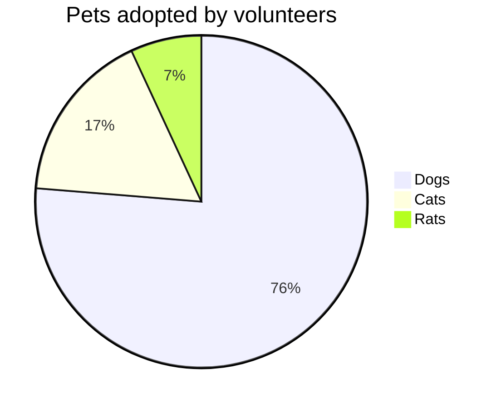
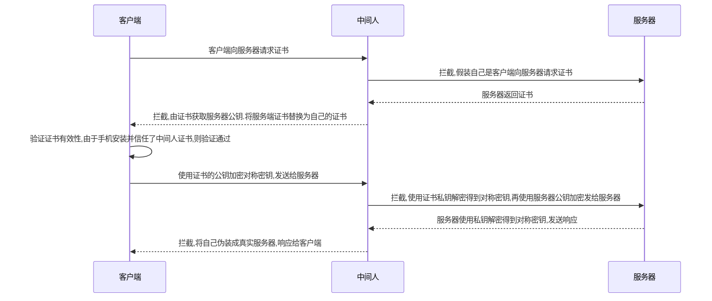

## 中间人抓https包的基本原理

>中间人本质就是
对客户端伪造自己是服务端
对服务端伪造自己是客户端

下图展示了常见的TLS四次握手的过程中抓包软件如何工作

可以看到中间人成功在TLS的握手过程中拿到了会话加密用的对称密钥
>TLS1.3版本仅需两次握手,一个RTT时间,工作的核心逻辑不变

## 常见反抓包手段

- **证书固定**，客户端应用内置了服务端证书
- **双向认证**，不仅仅客户端校验服务器证书，服务器也要校验客户端证书
- **系统限制**，如安卓高版本默认不信任用户安装的证书

### 证书固定

客户端应用内置了服务端证书，客户端应用会校验中间人服务端返回的证书是否与内置服务端证书一致
>有些服务端证书是自签名的（没有找第三方CA），那么应用一定会有证书固定

对于这种情况，一般有两类处理办法

1. 找后端要公钥证书以及私钥（逆向可以获取公钥证书，但是没有私钥看不到任何明文数据），导入抓包软件，让抓包软件成为更“真”的服务端
2. hook掉客户端相关验证服务端证书的方法，使客户端应用不再验证内置证书

对于第二点，在安卓上Xposed 和 Magisk 都有相应的模块，实现了该功能

### 双向认证

客户端额外内置一套公钥证书和私钥，在TLS握手流程中，服务器验证客户端的身份（应该是TLS第三次握手时发送给服务端，服务端校验证书可信后，用客户端证书公钥加密发送数据，有误的话请指正）

对于这种，需要逆向获得客户端应用的公钥证书和私钥，导入抓包软件，让抓包软件成为更“真”的客户端

### 系统限制

已知Android7.0以后系统不在信任用户的证书.这种情况下有以下几种选择：

1. 用模拟器，使用低版本的安卓系统
2. root手机，将证书放置在系统目录下
3. 找开发修改 targetSDKVersion使其小于23，重新编译打包
