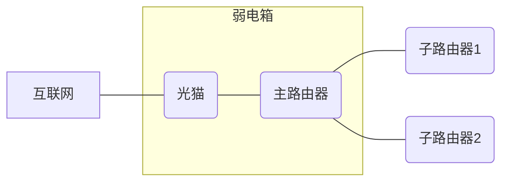
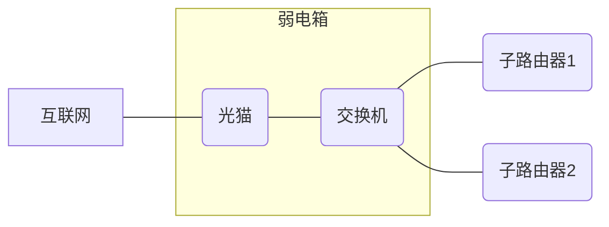
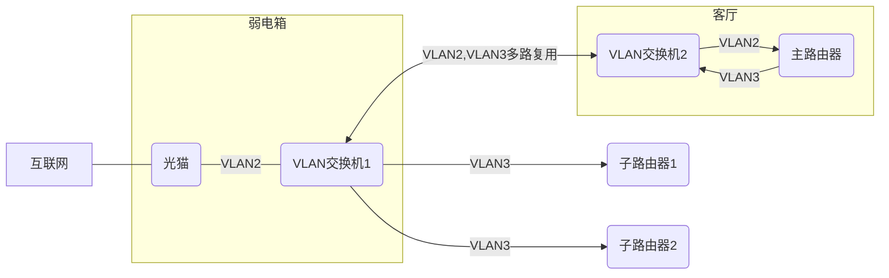

# 前言

随着各种智能家居的发展，实现全屋wifi覆盖的必要性越来越高，尤其是没有预埋足够多网线的屋子X_X  

在我实测下，我家2.4G频段的wifi信号，穿了一堵墙，信号衰减20db左右，在信号减到-70db后，就已经是几乎不能用的水平了

# 目前主流覆盖方案

两种，**mesh组网**和**AC+AP组网**，这两种是适应场景最多最广的，除此之外还有信号放大器，电力猫等，但这些要么就是特定场景下有用，要么就已经过时了，设备都不再生产了

目前我家网线的布局情况是,每个房间一个网线网口,最终汇集到弱电箱内

## mesh组网

**方案一**
一种是在弱电箱里放一个主路由器,用它的LAN口连网线到各个子路由器,如下图

弱电箱一般放在楼道里,这是主路由的wifi可能就有点浪费,另外路由器发热严重,需要做好散热(可以考虑将主路由放在弱点箱外通风处)

**方案二**
还有一种方式是AP mesh组网,由光猫负责拨号,如下图  

如果光猫自带的千兆网口够用的话,也可以不用交换机,将子路由器直接街道光猫上,这种方法对光猫的性能有较高要求

**方案三**
方案一中主路由的Wifi浪费,想把主路由放客厅,其他子路由放房间里怎么办,在每个房间只有一个网线拉到弱电箱的情况下,想把主路由放客厅,可以考虑单线复用mesh组网,就是使用两个带vlan功能的交换机,如下图

如果有网络电视的话(IPTV),还需要再多划分一个虚拟局域网给到电视

## AC+AP组网

AC(Access Point),接入控制器  
AP(Access Point)，接入点  

在家用中,AC控制器一般都选择一体机,包含AC控制器,路由功能,PoE供电功能  
AP一般是开关面板的形式,因为只需要充当类似天线的功能,所以体积做的比一般路由器小很多