## 前言

>设计模式博大精深，本文深入程度为分清设计模式的分类以及设计模式的意图，结构图

## 创建型模式

### 抽象工厂

意图:提供一个接口以创建一系列相关或相互依赖的对象，而无需指定它们具体的类

结构：(用mermaid默认的样式绘制好丑，而且控制不了位置布局)

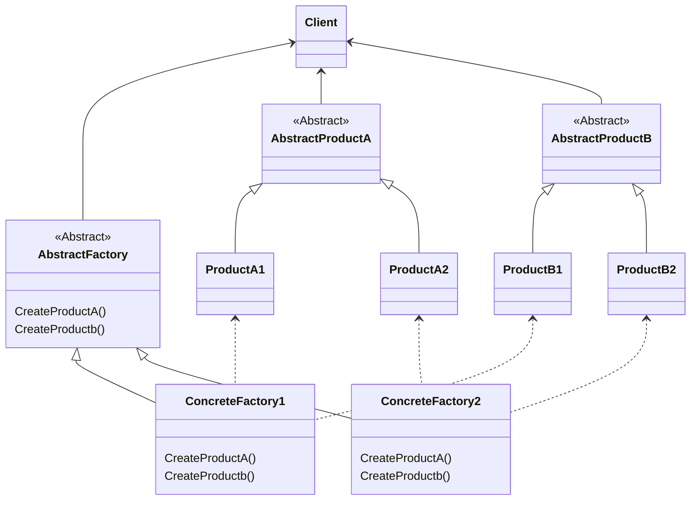
```mermaid
classDiagram
direction TB
class AbstractFactory{
    <<Abstract>>
    CreateProductA()
    CreateProductb()
}

class ConcreteFactory1{
    CreateProductA()
    CreateProductb()
}

class ConcreteFactory2{
    CreateProductA()
    CreateProductb()
}


AbstractFactory <|-- ConcreteFactory1
AbstractFactory <|-- ConcreteFactory2

class AbstractProductA{
    <<Abstract>>
}
class ProductA1
class ProductA2
AbstractProductA <|-- ProductA1
AbstractProductA <|-- ProductA2

class AbstractProductB{
    <<Abstract>>
}
class ProductB1
class ProductB2
AbstractProductB <|-- ProductB1
AbstractProductB <|-- ProductB2


ProductA1 <.. ConcreteFactory1
ProductB1 <.. ConcreteFactory1

ProductA2 <.. ConcreteFactory2
ProductB2 <.. ConcreteFactory2


class Client
Client <-- AbstractFactory
Client <-- AbstractProductA
Client <-- AbstractProductB

```

>抽象工厂类一般使用**工厂方法**实现，也可以使用**原型**实现
一个具体的工厂一般是一个**单例**

### 生成器（Builder）

意图:将一个复杂对象都是构建与它的表示分离，使同样的构建过程可以创建不同的表示

结构：

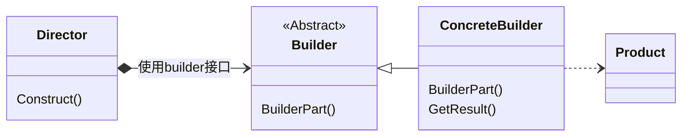
```mermaid
classDiagram

direction LR
class Director{
    Construct()
}


class Builder{
    <<Abstract>>
    BuilderPart()
}

class ConcreteBuilder{
    BuilderPart()
    GetResult()
}


Builder <|-- ConcreteBuilder

Director *--> Builder:使用builder接口

ConcreteBuilder ..> Product 

```

### 工厂方法

意图：定义一个创建对象的接口，让子类决定实例化哪一个类，工厂方法使类的实例化延迟到其子类

结构：

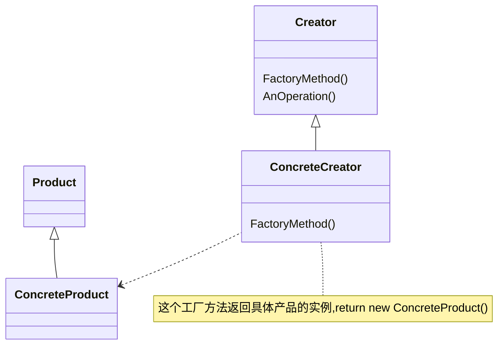
```mermaid
classDiagram
direction BT

class Product
class ConcreteProduct

ConcreteProduct --|> Product

class Creator{
    FactoryMethod()
    AnOperation()
}


class ConcreteCreator{
    FactoryMethod()
}

ConcreteCreator --|> Creator

note for ConcreteCreator "这个工厂方法返回具体产品的实例,return new ConcreteProduct()"


ConcreteProduct <.. ConcreteCreator

```

### 原型

意图：用原型实例指定创建对象的种类，并且通过**拷贝**这些原型创建新的对象

结构：

### 单例

意图：保证一个类只有一个实例，并提供一个访问该实例的全局访问点

## 结构型模式

### 适配器

意图：将一个类的接口转换成客户希望的另一个接口。适配器模式使原本由于接口不兼容而不能一起工作的类可以一起工作。

结构：

类适配器使用多重继承实现

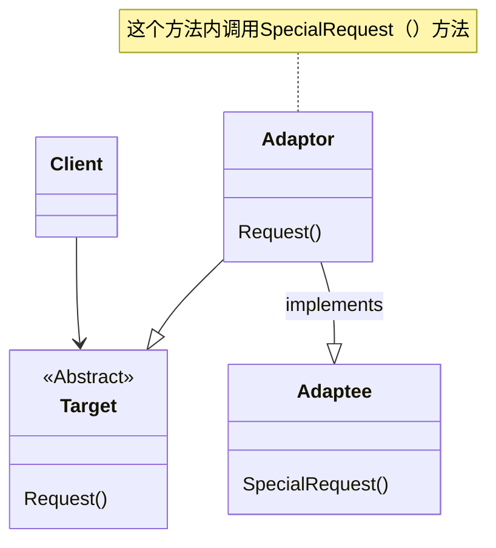
```mermaid
classDiagram

class Target{
    <<Abstract>>
    Request()
}
Client --> Target

class Adaptor{
    Request()
}

Adaptor --|> Target

class Adaptee{
    SpecialRequest()
}

Adaptor --|> Adaptee:implements

note for  Adaptor "这个方法内调用SpecialRequest（）方法"

```

对象适配器使用对象组合实现

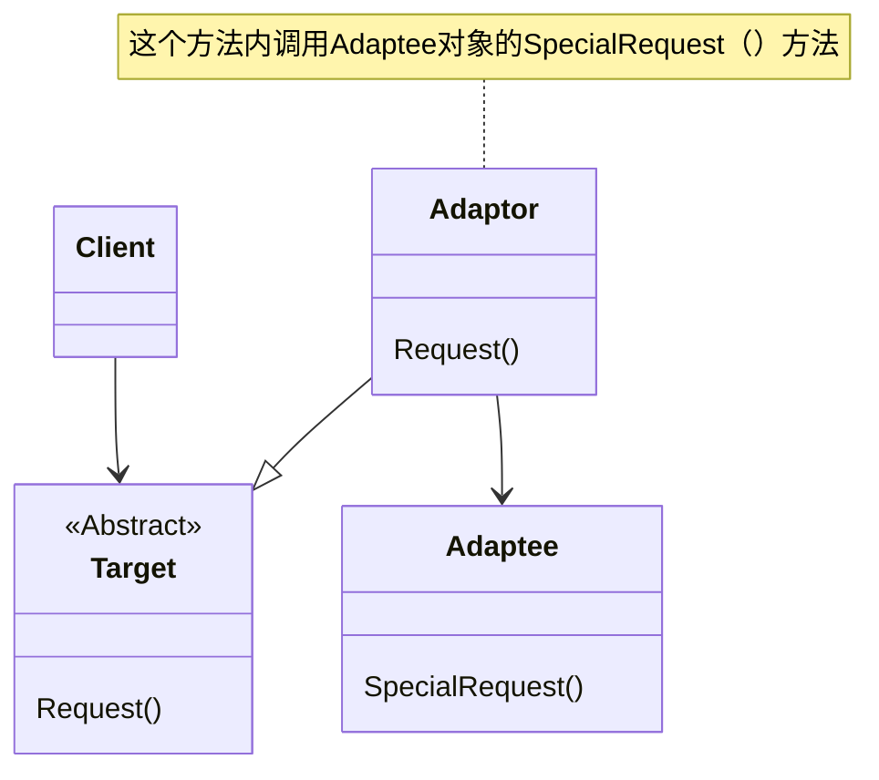
```mermaid
classDiagram

class Target{
    <<Abstract>>
    Request()
}
Client --> Target

class Adaptor{
    Request()
}

Adaptor --|> Target

class Adaptee{
    SpecialRequest()
}

Adaptor --> Adaptee

note for  Adaptor "这个方法内调用Adaptee对象的SpecialRequest（）方法"

```

### 桥接

意图：将抽象部分与它的实现部分分离，使它们可以独立的变化

结构：

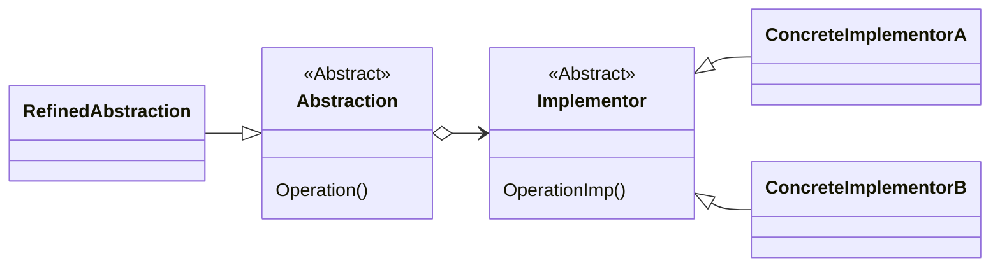
```mermaid
classDiagram
direction LR
class Abstraction{
    <<Abstract>>
    Operation()
}

Abstraction o--> Implementor

class Implementor{
    <<Abstract>>
    OperationImp()
}

Implementor <|-- ConcreteImplementorA

Implementor <|-- ConcreteImplementorB

RefinedAbstraction --|> Abstraction

```

### 组合

意图：将对象组合成树形结构以表示“部分-整体”的层次结构，组合模式使用户对单个对象和组合对象的访问具有一致性

结构：

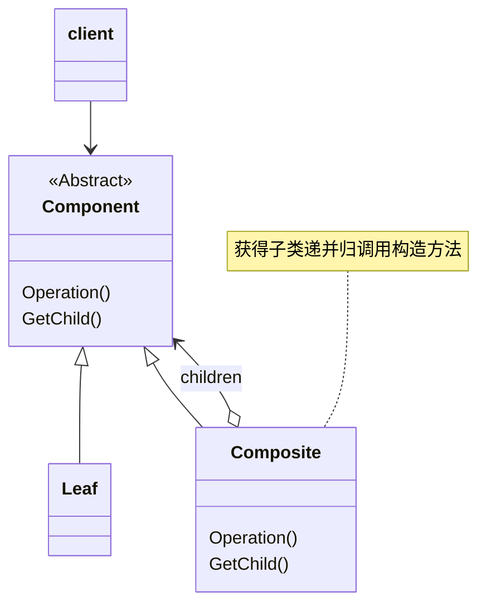
```mermaid
classDiagram
direction TB
client -->Component

class Component{
    <<Abstract>>
    Operation()
    GetChild()
}

Component <|-- Leaf
Component <|-- Composite

class Composite{
    Operation()
    GetChild()
}

note for Composite "获得子类递并归调用构造方法"

Composite o-->Component: children

```

### 装饰器

意图：动态的给一个对象添加一些额外的职责。就增加功能来说，比生成子类更加灵活

结构：

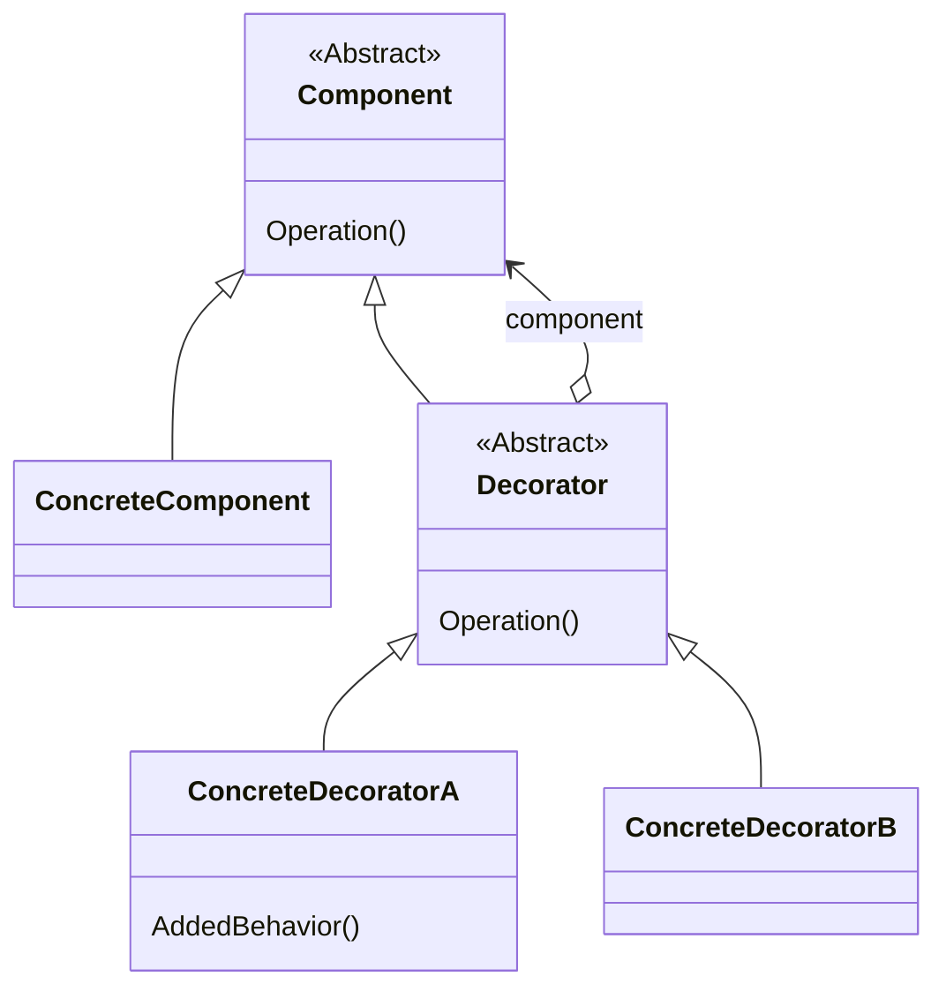
```mermaid
classDiagram
direction TB

class Component{
    <<Abstract>>
    Operation()
}

Component <|-- ConcreteComponent
Component <|-- Decorator

class Decorator{
    <<Abstract>>
    Operation()
}

Decorator o-->Component: component

Decorator <|-- ConcreteDecoratorA
Decorator <|-- ConcreteDecoratorB
class ConcreteDecoratorA{
    AddedBehavior()
}

```

### 外观（Facade）

意图：为子系统中的一组接口提供一个一致的界面，外观模式定义了一个高层接口。使得子系统更加易用

结构：

外观（Facade）对象单向关联子系统中的某些模块

### 享元（Flyweight）

意图：运用共享记得胡有效地支持大量细粒度的对象

结构：

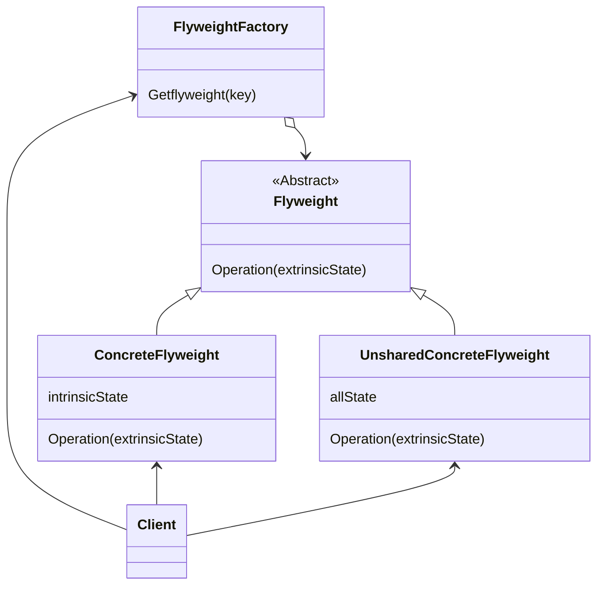
```mermaid
classDiagram
direction TB

class FlyweightFactory{
    Getflyweight(key)
}

FlyweightFactory o-->Flyweight

class Flyweight{
    <<Abstract>>
    Operation(extrinsicState)
}

Flyweight <|-- ConcreteFlyweight
Flyweight <|-- UnsharedConcreteFlyweight

class ConcreteFlyweight{
    Operation(extrinsicState)
    intrinsicState
}

class UnsharedConcreteFlyweight{
    Operation(extrinsicState)
    allState
}

FlyweightFactory <-- Client
ConcreteFlyweight <-- Client
UnsharedConcreteFlyweight <-- Client

```

每一个共享的对象，分内部状态和外部状态，内部状态一致，外部状态组要调用者传如，FlyweightFactory管理所有共享对象实例(如果已有某个享元实例则返回，没有则new一个)，用户最好用此工厂类获得对象，而不是直接实例化具体的享元类

### 代理(Proxy/Surrogate)

意图：为其他对象提供一种代理以控制对这个对象的访问

结构：

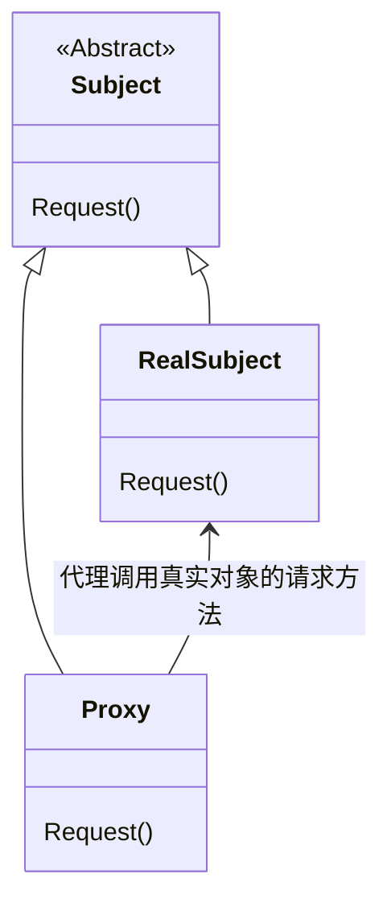
```mermaid
classDiagram
direction TB

class Subject{
    <<Abstract>>
    Request()
}

class RealSubject{
    Request()
}

class Proxy{
    Request()
}

Subject <|-- RealSubject
Subject <|-- Proxy

RealSubject <-- Proxy:代理调用真实对象的请求方法

```

## 行为型模式

### 责任链

意图：使多个对象都有机会处理请求。从而避免请求发送者和接收者之间的耦合关系。将这些对象连成一条链，并沿着传递请求，直到一个对象处理它为止。

结构：

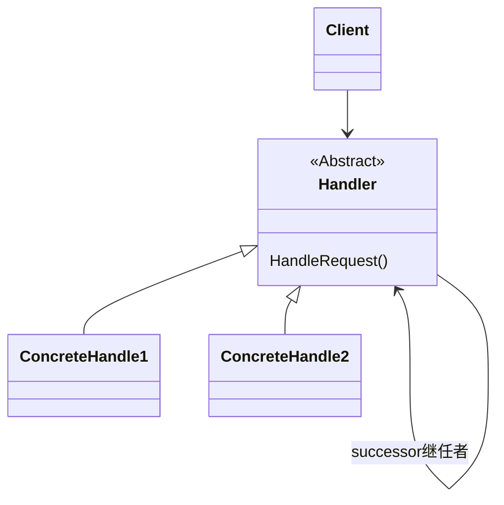
```mermaid
classDiagram
direction TB

class Handler{
    <<Abstract>>
    HandleRequest()
}

Handler <-- Handler: successor继任者

Handler <|-- ConcreteHandle1

Handler <|-- ConcreteHandle2

Client --> Handler

```

### 命令模式

意图：将一个请求封装为对象，从而使你可用不同的请求对客户进行参数话，对请求排队或记录请求日志，以及支持可撤销的操作。

别名动作（action）,事务（transaction）

结构：

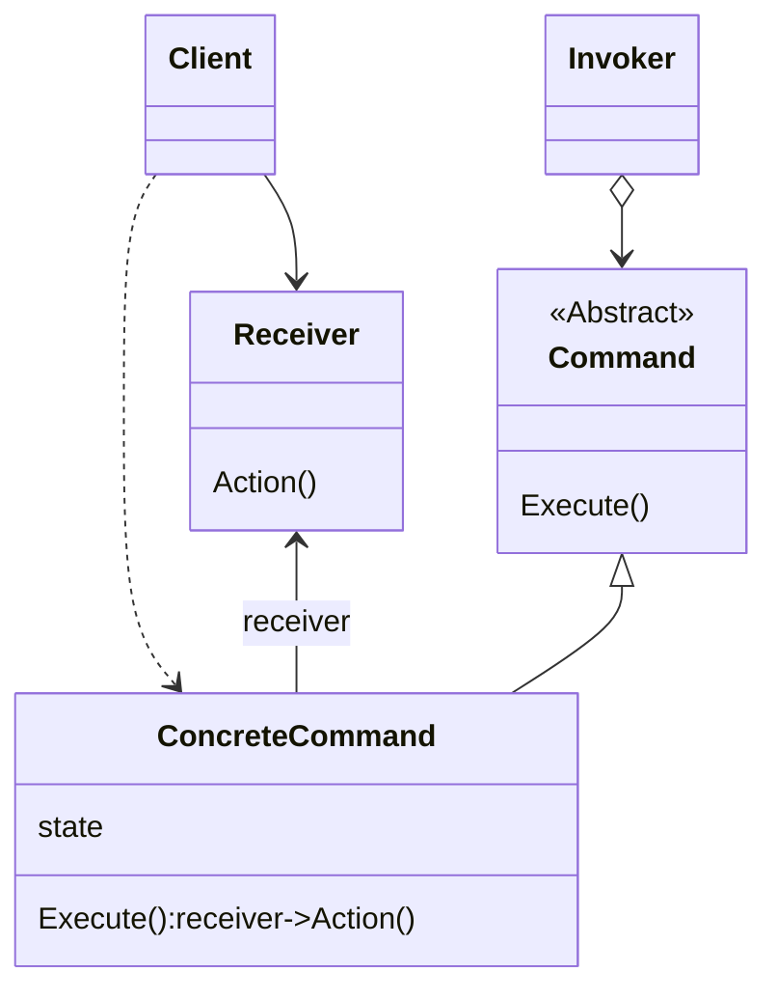
```mermaid
classDiagram

class Receiver{
    Action()
}

class Command{
    <<Abstract>>
    Execute()
}

class ConcreteCommand{
    Execute():receiver->Action()
    state
}

Receiver <-- ConcreteCommand:receiver


Command <|-- ConcreteCommand

Client ..> ConcreteCommand
Client --> Receiver

Invoker o--> Command
```

### 解释器

意图：给定一个语言，定义它的文法的一种表示，并定义一个解释器，这个解释器适用该表示来解释语言中的句子

结构：

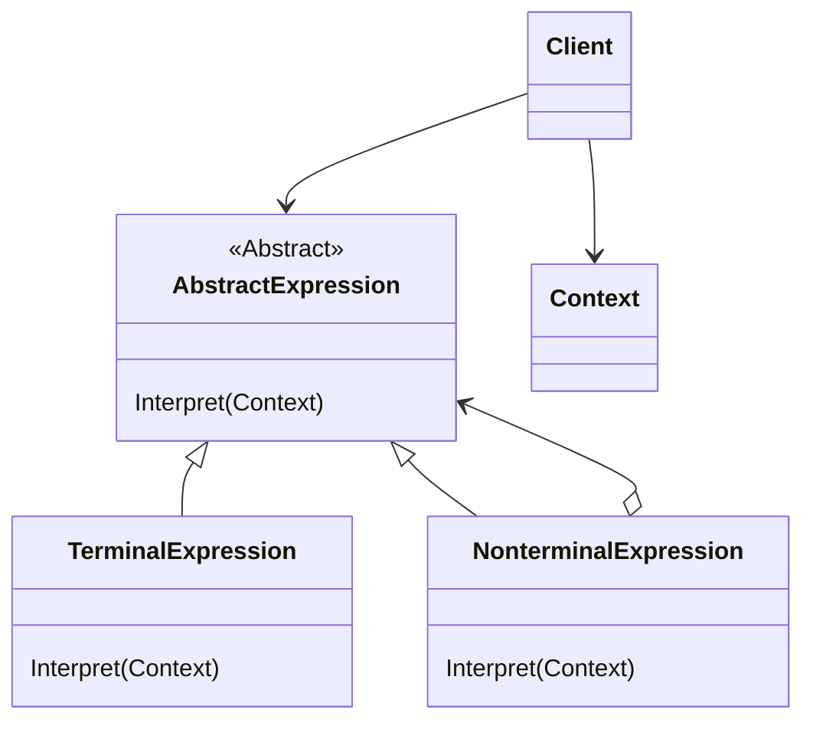
```mermaid
classDiagram

class AbstractExpression{
    <<Abstract>>
    Interpret(Context)
}

class TerminalExpression{
    Interpret(Context)
}
class NonterminalExpression{
    Interpret(Context)
}

AbstractExpression <|-- TerminalExpression
AbstractExpression <|-- NonterminalExpression
NonterminalExpression o--> AbstractExpression

Client --> AbstractExpression
Client --> Context
```

被解释的语言（比如正则表达式）会表示为一个抽象语法树，然后解释执行，这个模式适合文法简单，不追求效率的情况下使用（追求效率的话就不使用语法分析树来实现，比如正则表达式通常被转换成状态机）

### 迭代器

意图：提供一种方法顺序访问一个聚合对象中的各个元素，而不需要暴露该对象的内部表示

结构：

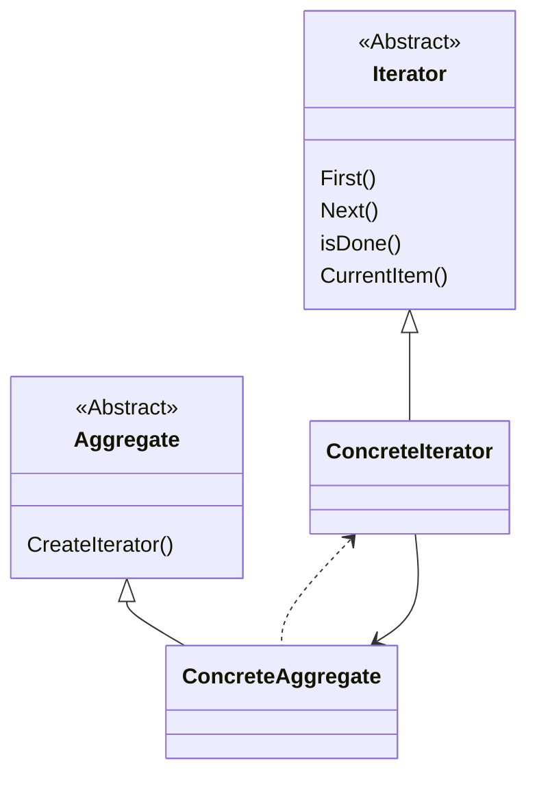
```mermaid
classDiagram

class Aggregate{
    <<Abstract>>
    CreateIterator()
}

class Iterator{
    <<Abstract>>
    First()
    Next()
    isDone()
    CurrentItem()
}

Aggregate <|-- ConcreteAggregate
Iterator <|-- ConcreteIterator

ConcreteIterator <.. ConcreteAggregate
ConcreteIterator --> ConcreteAggregate

```

### 中介者（Mediator）

意图：用一个中介对象来封装一系列对象的交互，中介对象使各对象不需要显式引用，从而使其耦合松散，而且可以独立地改变它们之间的交互

结构：

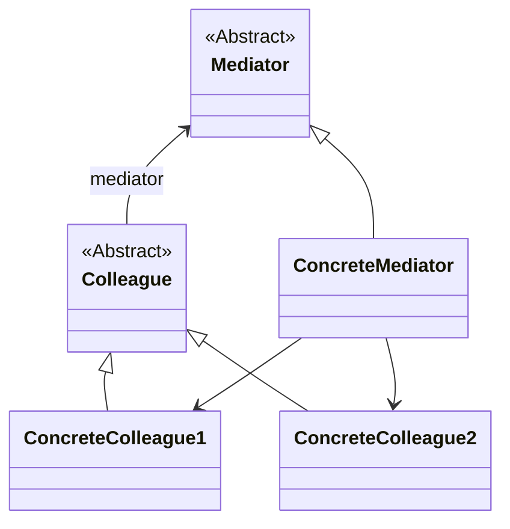
```mermaid
classDiagram

class Mediator{
    <<Abstract>>
}

Mediator <|-- ConcreteMediator

class Colleague{
    <<Abstract>>
}

Colleague <|-- ConcreteColleague1
Colleague <|-- ConcreteColleague2


ConcreteMediator --> ConcreteColleague1
ConcreteMediator --> ConcreteColleague2

Mediator <-- Colleague:mediator

```

当对象之间通信复杂交错时，可以尝试使用这种模式

### 备忘录（Memento）

意图：在不破坏封装性的前提下，捕获一个对象的内部状态，并在该对象之外保存这个状态，这样以后就可将该对象恢复到原先保存的状态

结构：

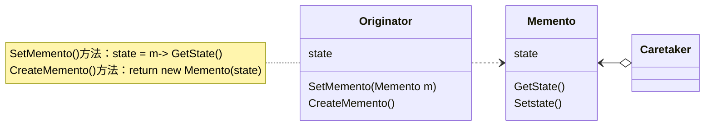
```mermaid
classDiagram
direction LR

class Originator{
    state
    SetMemento(Memento m)
    CreateMemento()
}

note for Originator "SetMemento()方法：state = m-> GetState() 
CreateMemento()方法：return new Memento(state)" 

Originator ..>Memento

class Memento{
    state
    GetState()
    Setstate()
}

Memento <--o Caretaker
```

备忘录只有源对象（原发器）可以访问内容，管理员（Caretaker）只能帮对象请求备忘录，送回备忘录，不能对备忘录内容进行操作

### 观察者

意图：定义对象间的一种一对多的依赖关系，当一个对象的状态发生改变时，所有依赖于它的对象得到通知并自动更新

结构：

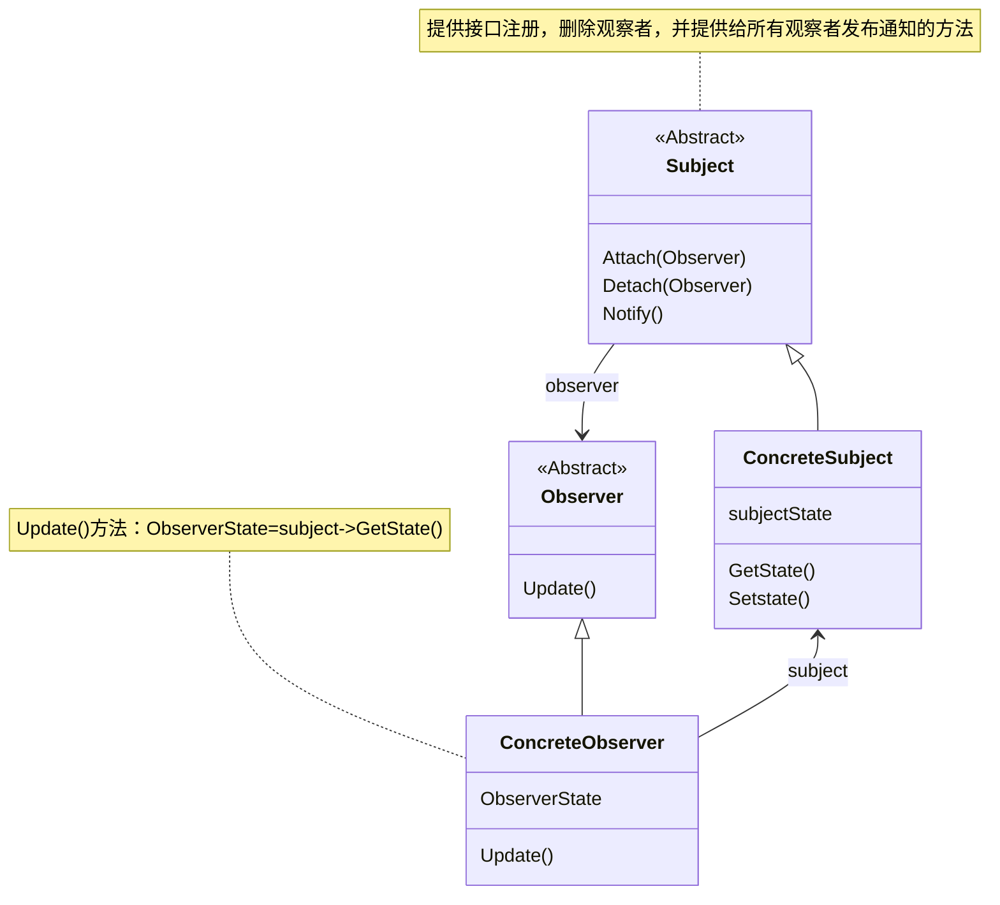
```mermaid
classDiagram

class Subject{
    <<Abstract>>
    Attach(Observer)
    Detach(Observer)
    Notify()
}

note for Subject "提供接口注册，删除观察者，并提供给所有观察者发布通知的方法"

class Observer{
    <<Abstract>>
    Update()
}

Subject --> Observer:observer

class ConcreteSubject{
    subjectState
    GetState()
    Setstate()
}
Subject <|-- ConcreteSubject

class ConcreteObserver{
    ObserverState
    Update()
}
Observer <|-- ConcreteObserver

ConcreteSubject <-- ConcreteObserver:subject

note for ConcreteObserver "Update()方法：ObserverState=subject->GetState()"
```

### 状态

意图：允许一个对象在其内部状态改变时改变它的行为。对象看起来似乎修改了它的类

结构：

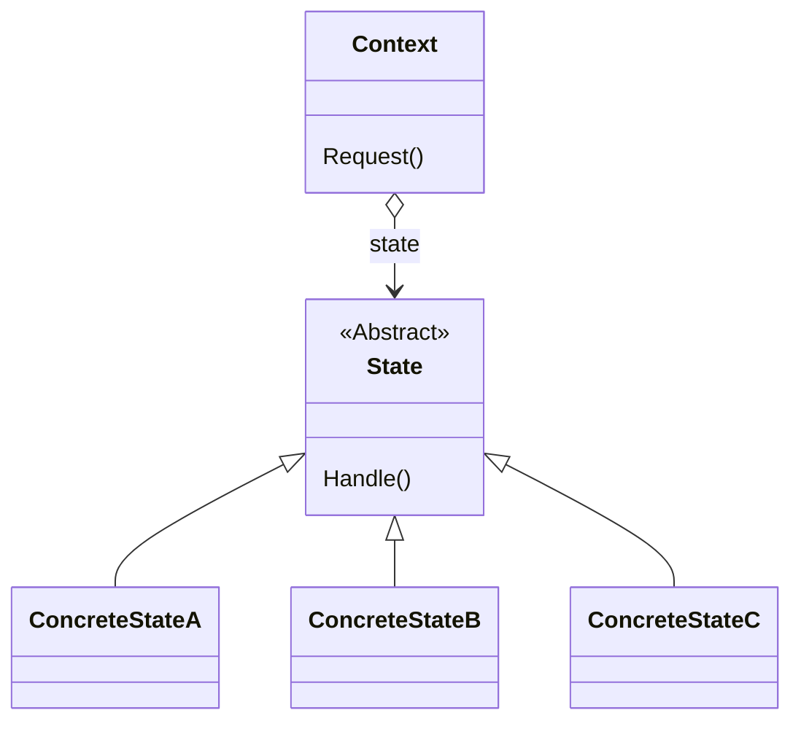
```mermaid
classDiagram

class Context{
    Request()
}

Context o--> State:state

class State{
    <<Abstract>>
    Handle()
}

State <|-- ConcreteStateA
State <|-- ConcreteStateB
State <|-- ConcreteStateC
```

### 策略（strategy）

意图：定义一系列算法，并封装他们，使他们可以相互替换。本模式使得算法可以独立于它的客户而变化

结构：
类图与状态模式看不出区别hh

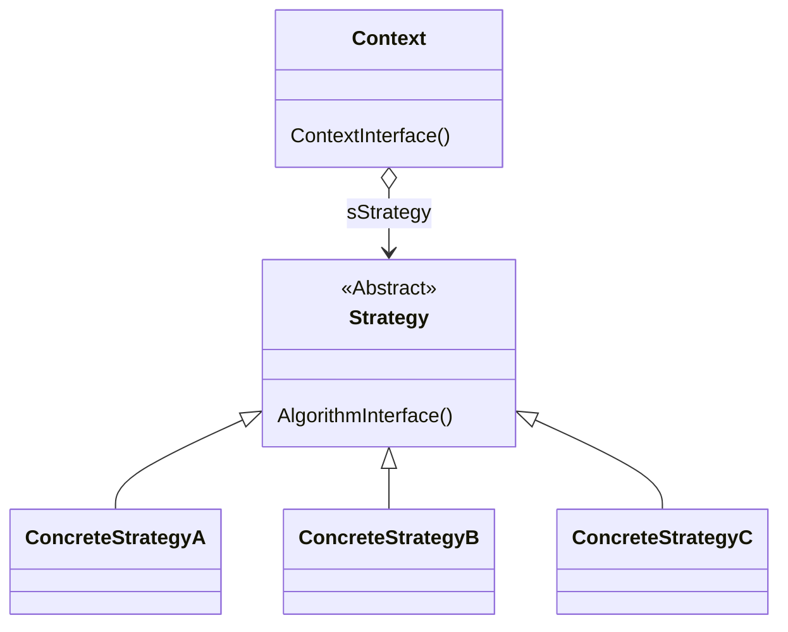
```mermaid
classDiagram

class Context{
    ContextInterface()
}

Context o--> Strategy:sStrategy

class Strategy{
    <<Abstract>>
    AlgorithmInterface()
}

Strategy <|-- ConcreteStrategyA
Strategy <|-- ConcreteStrategyB
Strategy <|-- ConcreteStrategyC
```

### 模板方法

意图：定义一个操作中算法的骨架，而将一些步骤延迟到子类中。模板方法使得子类可以不改变算法的结构即可重定义该算法的某些特定步骤

结构：

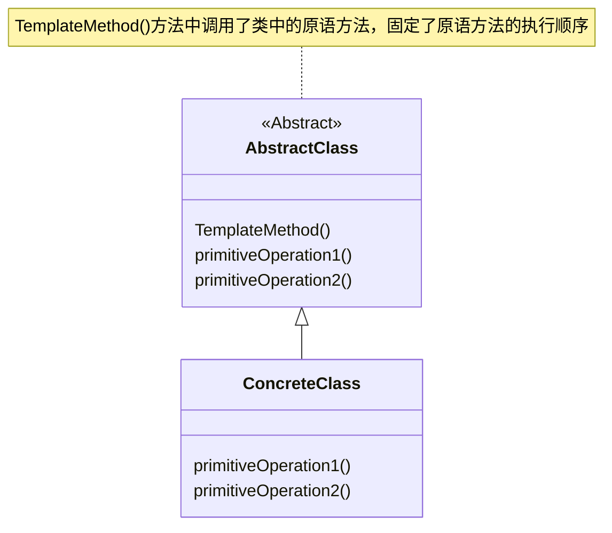
```mermaid
classDiagram

class AbstractClass{
    <<Abstract>>
    TemplateMethod()
    primitiveOperation1()
    primitiveOperation2()
}

class ConcreteClass{
    primitiveOperation1()
    primitiveOperation2()
}
AbstractClass <|-- ConcreteClass

note for AbstractClass "TemplateMethod()方法中调用了类中的原语方法，固定了原语方法的执行顺序"
```

### 访问者

意图：表示一个作用于某对象结构的各元素操作。它可以使你在不改变各元素类的前提下定义作用于这些元素的新操作

结构：

结构：

```mermaid
classDiagram
direction TB

class Visitor{
    <<Abstract>>
    VisitConcreteElementA(ConcreteElementA)
    VisitConcreteElementB(ConcreteElementB)
}

class ConcreteVisitor1{
    VisitConcreteElementA(ConcreteElementA)
    VisitConcreteElementB(ConcreteElementB)
}
class ConcreteVisitor2{
    VisitConcreteElementA(ConcreteElementA)
    VisitConcreteElementB(ConcreteElementB)
}
Visitor <|-- ConcreteVisitor1
Visitor <|-- ConcreteVisitor2

class Element{
    <<Abstract>>
    Accept(Visitor)
}

class ConcreteElementA{
    Accept(Visitor v)
    OperationA()
}
class ConcreteElementB{
    Accept(Visitor v)
    OperationB()
}
Element <|-- ConcreteElementA
Element <|-- ConcreteElementB

Client --> Visitor
Client --> ObjectStructure
ObjectStructure --> Element
```

访问者模式适合对象结构类基本不会改变的情况下，如果经常改变，用此模式增加操作几乎要修改所有visitor类，不知直接在对象结构类中定义操作0.0
