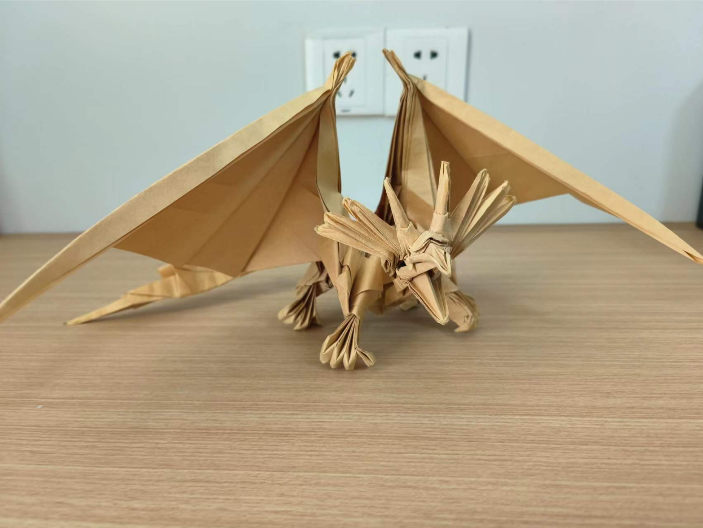
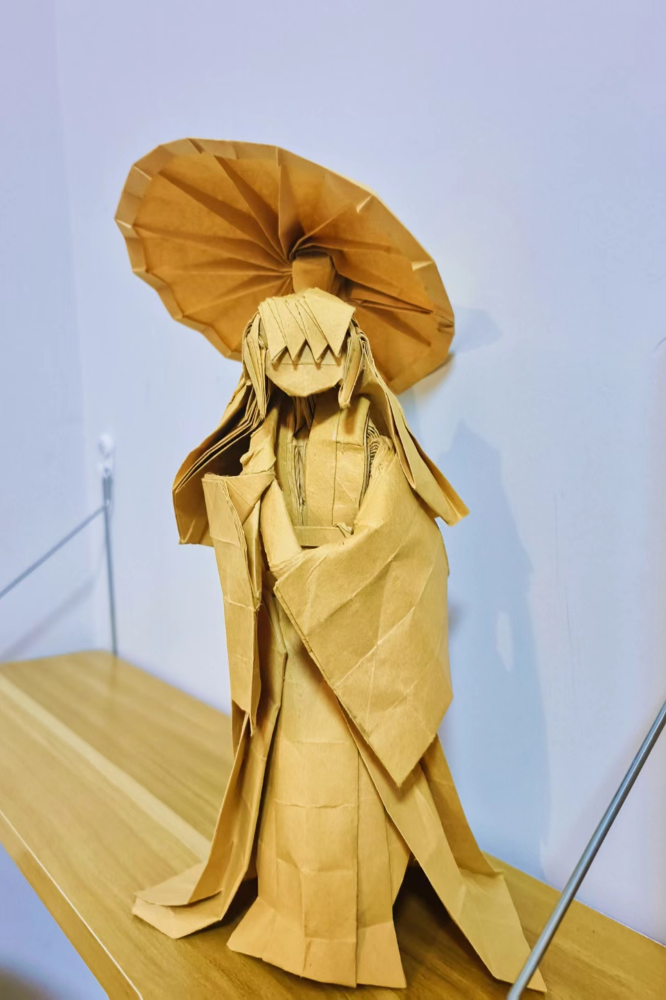

## 关于我

### 性格

- 轻微强迫症患者
- 在 **INTJ** 和 **INFJ** 之间来回横跳
- 乐于尝试新事物

### 观念（2023/8/16）

- 认为睡觉真是人生第一幸福的事情，吃饭排第二
- 实践番茄法后发现，定时对我意义不大，如果可能的话，我一般会持续专注到一件事情解决或者取得阶段性进展的时候
- 曾经的悲观主义者，虚无主义者，现在只想好好吃饭睡觉
- 不成熟的理想主义者，踏入社会后，逐步意识到需要在理想和现实间寻求平衡
- 期待一场从天而降，破门而入的爱情

### 爱好

- 折纸，现代折纸发展的很不错，就是折cp图很烦
贴两张作品：
  
  

- 喜欢哲学，尤其是道家哲学，但目前只是个半吊子
- 喜欢心理学，但目前只是半吊子
- 喜欢乒乓球，篮球（太矮了，170，┭┮﹏┭┮）

### 其他

- 最近长胖了，努力减肥中